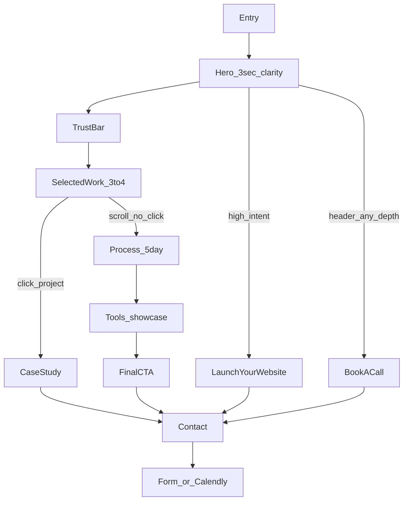
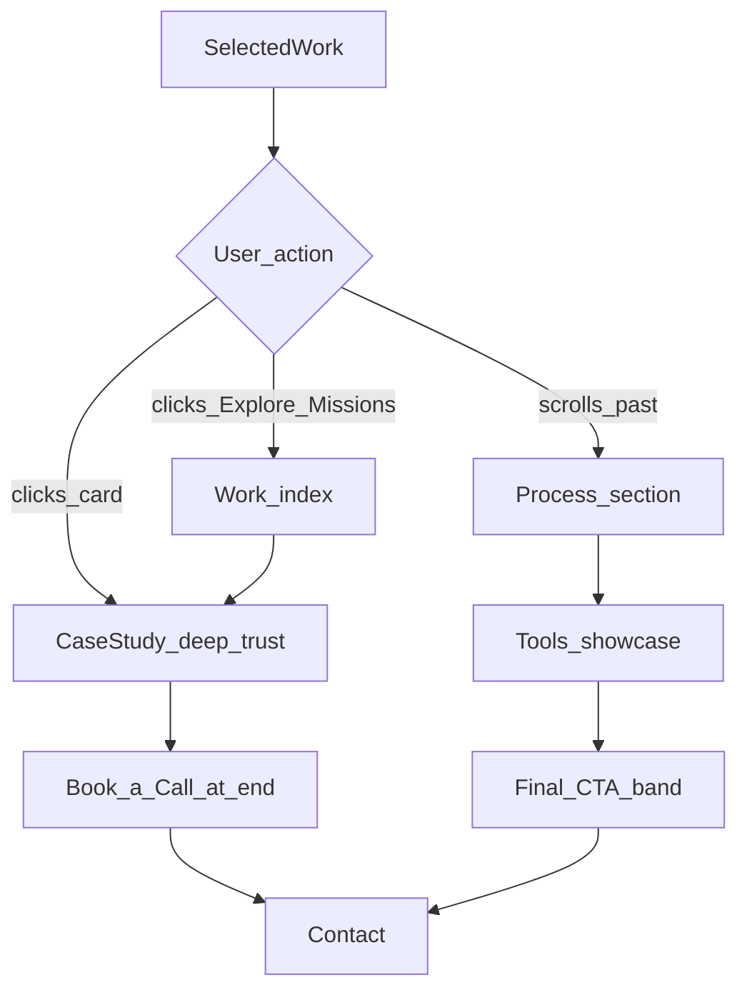

# Homepage Conversion Flow

**Page:** `/` (Homepage — The Pitch)  
**Brand:** Cinematic Mission  
**Goals:** (A) View work — build trust · (B) Contact — hire  
**Macro-conversions:** Form submitted · Calendly call booked  
**Last updated:** May 2026

---

## Objectives and Success Definition

### Business goals

| Goal | User action | Success signal |
|------|-------------|----------------|
| **A — Trust** | View work / case studies | Case study page view from homepage |
| **B — Hire** | Contact | Form submit or Calendly booking |

Both goals are valid. The homepage must serve **proof-first** visitors and **high-intent** visitors without forcing one path.

### 3-second clarity rule

Within the first viewport, a visitor must understand:

1. **What you do** — landing pages and portfolio websites (web design, not general software engineering)
2. **Who it's for** — creatives, SaaS founders, brands & agencies
3. **What to do next** — explore work or start a project

**Control copy (locked):**

| Element | Copy |
|---------|------|
| Kicker | Orbit-ready web design |
| Headline | Landing pages. Out of this world. |
| Subheadline | I design and build high-converting landing pages, portfolio websites, and modern web experiences for brands and creators. |
| Primary CTA | Launch Your Website → `/contact` |
| Secondary CTA | Explore Missions → `/work` |

### Micro-conversions (homepage)

| Event | Meaning |
|-------|---------|
| `explore_missions_click` | Hero or section CTA to work |
| `case_study_click` | Selected work card → `/work/[slug]` |
| `launch_website_click` | Hero primary → contact |
| `book_call_click` | Header or final CTA → contact |

### Macro-conversions (cross-page)

| Event | Meaning |
|-------|---------|
| `contact_form_submit` | Inquiry form completed |
| `calendly_booked` | 15-min call scheduled |

**Pre-launch baseline:** All KPIs = TBD until analytics is wired at build phase.

---

## Conversion Glossary

Maps generic portfolio labels to locked Cinematic Mission CTAs.

| Generic / test label | Locked label | Destination |
|---------------------|--------------|-------------|
| View Work | Explore Missions | `/work` |
| View My Work | Explore Missions (A/B: CTA1) | `/work` |
| See Recent Projects | Explore Missions (A/B: CTA2) | `/work` |
| Get in Touch | Launch Your Website / Book a Call | `/contact` |
| View case study | View Case Study | `/work/[slug]` |
| Ready to work together? | Ready for your new portfolio or landing page? | Final CTA band |

---

## Homepage Section Orders

Two documented orders — wireframes should use **proof-first** unless running test ORD1.

### Proof-first (recommended for conversion)

Optimizes Goal A immediately after credibility scan.

| Order | Section | ID | Purpose |
|-------|---------|-----|---------|
| 1 | Hero | `#hero` | Clarity + primary CTAs |
| 2 | Trust bar | `#trust` | Copy-only credibility strip |
| 3 | Selected work | `#work` | Option B: 1 live project + coming soon |
| 4 | Process | `#process` | 5-day timeline — reduces uncertainty |
| 5 | Tools showcase | `#tools` | Technical stack credibility |
| 6 | Final CTA | `#cta` | Last-chance conversion |
| 7 | Footer | — | Nav, newsletter, persistent CTAs |

**Not on homepage v1:** Services snapshot · Testimonials (deferred v2). Bridge after process: `View Services` → `/services`.

### IA brief order (reference)

From [page-briefs.md](./page-briefs.md) — use for A/B test ORD1 challenger.

| Order | Section |
|-------|---------|
| 1 | Hero |
| 2 | Trust bar |
| 3 | Services snapshot |
| 4 | Process |
| 5 | Selected work |
| 6 | Testimonials |
| 7 | Final CTA |
| 8 | Footer |

**Rationale for proof-first:** Users who need proof click work before reading process. Users who scroll past work without clicking need process + tools credibility before the final CTA — matching your alternate path.

---

## Full Flow Diagram



### Decision at Selected Work



---

## Primary Path — Proof Then Convert

**Best for:** Visitors who need to see quality before hiring.  
**Intent arc:** Curious → impressed → convinced → action

| Step | Section | User mental state | CTA(s) | Destination | Intent |
|------|---------|-------------------|--------|-------------|--------|
| 1 | Entry | "Who is this?" | — | — | Low |
| 2 | Hero | "Do they do what I need?" | Launch Your Website · Explore Missions | `/contact` · `/work` | Low–medium |
| 3 | Trust bar | "Are they legit?" | None (scan only) | — | Medium |
| 4 | Selected work | "Can they actually design?" | View case study (per card) | `/work/[slug]` | Medium–high |
| 5 | Case study | "Would I trust them with my site?" | Book a Call · Start an Inquiry | `/contact` | High |
| 6 | Contact | "I'm ready to talk" | Submit · Calendly | — | Highest |
| 7 | Conversion | — | Form submit / call booked | — | **Converted** |

**Expected session length:** 2–5 minutes  
**Highest-quality leads:** Case study viewed before contact

---

## Alternate Path — Scroll Without Project Click

**Best for:** Visitors who scan the full page before committing.  
**Intent arc:** Skeptical → informed → socially validated → action

| Step | Section | User mental state | Drop-off risk |
|------|---------|-------------------|---------------|
| 1 | Hero | Same as primary | High if headline unclear |
| 2 | Trust bar | Quick credibility check | Low — passive scan |
| 3 | Selected work | Browses but doesn't click | **Medium** — may leave here |
| 4 | Process | "How does this work? Can they deliver fast?" | Medium if timeline unclear |
| 5 | Tools | "Do they have a serious stack?" | Low — passive scan |
| 6 | Final CTA | "Ready for your new portfolio or landing page?" | Low if prior sections landed |
| 7 | Contact | Chooses form or call | Conversion |

**CTAs on this path:**

- Process section: See full process → `/services#process`
- Final CTA band: Book a Call · Start an Inquiry → `/contact`
- Header (persistent): Book a Call at any scroll depth

---

## High-Intent Shortcuts

Visitors who skip proof — optimize for speed, not friction.

| Entry | Trigger | Path | Conversion point |
|-------|---------|------|------------------|
| Hero primary | Already decided to hire | Launch Your Website → `/contact` | Form or Calendly |
| Header CTA | Wants to talk now | Book a Call → `/contact#book` | Calendly |
| Footer | Finished scanning elsewhere | Book a Call / Start an Inquiry | Contact |
| Nav Contact | Direct navigation | `/contact` | Form or Calendly |

**Do not block shortcuts** with modals or forced work viewing — high-intent users convert on clarity and speed.

---

## Section-by-Section Conversion Spec

### 1. Hero (`#hero`)

| Attribute | Spec |
|-----------|------|
| Time budget | 3 seconds to value clarity |
| Primary CTA | Launch Your Website |
| Secondary CTA | Explore Missions |
| Persistent | Header Book a Call |
| Visual | Halftone spaceman poster (L0); hand reaches left toward headline; optional Blender loop Phase 2 |
| Failure mode | Bounce if service type unclear |

### 2. Trust bar (`#trust`)

| Attribute | Spec |
|-----------|------|
| Content (v1) | Copy-only: Agency-level craft. Days-not-months delivery. + Specialist in portfolios and landing pages only. |
| Tools | Full showcase in `#tools` section (not trust bar) |
| CTA | None — credibility only |
| Failure mode | Ignored scroll; no impact on trust |

### 3. Selected work (`#work`)

| Attribute | Spec |
|-----------|------|
| Count | 3–4 best projects |
| Interaction | Hover preview (image or metric reveal) |
| Card CTA | View project → `/work/by-jawad` (v1); View case study when client work exists |
| Section CTA | Explore Missions → `/work` |
| Failure mode | Scroll past without click — triggers alternate path |

### 4. Process (`#process`)

| Attribute | Spec |
|-----------|------|
| Content | 5-day timeline (discovery → launch) |
| Purpose | Reduce uncertainty for non-clickers |
| CTA | See full process → `/services#process` |
| Failure mode | Abandon if timeline feels unrealistic |

### 5. Tools showcase (`#tools`)

| Attribute | Spec |
|-----------|------|
| Count | 8 tools (Cursor, Claude, Figma, Next.js, Tailwind, Spline, GSAP, Supabase) |
| Purpose | Technical credibility before final ask (replaces testimonials role in v1) |
| CTA | None — credibility only |
| Failure mode | Ignored if grid feels generic |

### 6. Final CTA (`#cta`)

| Attribute | Spec |
|-----------|------|
| Headline | Ready for your new portfolio or landing page? |
| Subheadline | Tell me about your project — I'll reply within 24 hours. |
| CTAs | Book a Call · Start an Inquiry |
| Purpose | Last-chance conversion for alternate path users |

---

## Analysis Points and Heat-Map Hypotheses

### Zone hypotheses

| Zone | Likely behavior | Heat map signal | Investigation |
|------|-----------------|-----------------|---------------|
| Hero fold | Scan headline + CTAs; bounce if unclear | High attention, short duration | Bounce &lt; 25% scroll, &lt; 10s on page |
| Trust bar | Horizontal scan, few clicks | Low click density | Validates passively — track `trust_bar_view` |
| Selected work | Highest engagement | Clicks + hovers clustered on cards | Card CTR, hover rate |
| Process | Engaged non-clickers from work | Moderate attention mid-page | Scroll depth 50–75% |
| Testimonials | Read quotes, slow scroll | Pause before final CTA | Time in view |
| Final CTA | Decision point | Click cluster on buttons | `final_cta_click` vs header |

### Questions to answer with data

1. **Where do users drop off?** — Compare `section_view` funnel: hero → trust → work → process → tools → cta
2. **Scroll depth before bounce?** — Benchmark buckets: 25% / 50% / 75% / 100%
3. **Which hero CTA wins?** — `Explore Missions` vs `Launch Your Website` click share
4. **How many visit multiple case studies?** — Sessions with 2+ `project_card_click` or case study pageviews
5. **Assisted conversions?** — Homepage entry → case study → contact within 7 days

### Drop-off hypotheses by path

| Path | Likely drop-off point | Hypothesis |
|------|----------------------|------------|
| Primary | Selected work (no click) | Proof not compelling enough in thumbnails |
| Primary | Case study (no contact) | Case study lacks result metrics or CTA visibility |
| Alternate | Process | Timeline doesn't match visitor urgency |
| Alternate | Before final CTA | Testimonials weak or page too long |
| Shortcut | Contact form | Too many fields or no Calendly visibility |

---

## Metrics to Track

### GA4 event specification

| Event name | Trigger | Parameters |
|------------|---------|------------|
| `hero_cta_click` | Hero button click | `cta_label`, `destination`, `page_location` |
| `book_call_click` | Header/footer Book a Call | `source_section`, `page_location` |
| `trust_bar_view` | Trust strip 50% in viewport | `variant` (logos_stats / logos_only / client_logos) |
| `project_card_click` | Selected work card click | `project_slug`, `position`, `source` (homepage) |
| `project_hover` | Card hover ≥ 1s | `project_slug`, `position` |
| `section_view` | Section enters viewport (50%) | `section_name`, `scroll_depth_pct` |
| `explore_missions_click` | Explore Missions anywhere on homepage | `source_section` |
| `launch_website_click` | Launch Your Website on homepage | `source_section` |
| `final_cta_click` | Final CTA band button | `cta_label` |
| `view_services_click` | Services bridge link | `source_section` |
| `contact_form_submit` | Form success | `source_page`, `project_type`, `budget_range` |
| `calendly_booked` | Calendly confirmed | `source_page`, `referrer_section` |

### Section view sequence (funnel)

Track ordered `section_view` events to build a homepage funnel:

```
hero → trust → work → process → tools → cta
```

### KPI dashboard (review weekly)

| KPI | Formula | Target | Pre-launch |
|-----|---------|--------|------------|
| Hero clarity bounce rate | Sessions &lt; 10s, max scroll &lt; 25% / homepage sessions | Decrease | TBD |
| Work path rate | Sessions with ≥1 case study view / homepage sessions | Increase | TBD |
| Homepage → contact rate | Contact pageviews or conversions from homepage entry / homepage sessions | Increase | TBD |
| Case study → contact rate | Conversions with prior case study / case study views | &gt; 8% | TBD |
| Hero CTA preference index | `explore_missions_click` / `launch_website_click` | Monitor | TBD |
| Avg max scroll depth | Mean highest scroll % per session | 75%+ engaged | TBD |
| Multi-project view rate | Sessions with 2+ case studies / sessions with 1+ case study | Monitor | TBD |
| Final CTA vs header | `final_cta_click` / `book_call_click` | Monitor | TBD |
| Form vs Calendly split | `contact_form_submit` / `calendly_booked` | Monitor | TBD |

### Reporting cadence

| When | Action |
|------|--------|
| Pre-launch | Wire all events; verify in GA4 DebugView |
| Week 1 post-launch | Baseline all KPIs |
| Week 2–4 | Run first A/B test if ≥ 500 homepage sessions |
| Monthly | Review funnel drop-offs; update case study thumbnails if work CTR low |

---

## A/B Test Backlog

**Rules:** One variable at a time · Minimum 2 weeks or 500 homepage sessions · 95% confidence before declaring winner · Document winner in [cta-messaging-matrix.md](./cta-messaging-matrix.md)

| Test ID | Element | Control (A) | Challenger (B) | Primary metric | Secondary metric |
|---------|---------|-------------|----------------|----------------|------------------|
| **H1** | Headline | Landing pages. Out of this world. | Portfolio websites for creative professionals | Bounce rate | Scroll depth |
| **H2** | Headline | Control (H1 winner) | Your work deserves a website that sells itself | Hero CTA CTR | Work path rate |
| **CTA1** | Hero secondary | Explore Missions | View My Work | `hero_cta_click` → work | Case study CTR |
| **CTA2** | Hero secondary | Explore Missions | See Recent Projects | Case study CTR | Work path rate |
| **TR1** | Trust bar | Copy-only (v1 control) | Logo row in trust (challenger) | Scroll past trust | Work CTR |
| **TR2** | Trust bar | Tool logos | Client logos (when available) | Work CTR | Contact rate |
| **ORD1** | Section order | Proof-first (work before process) | IA brief order (services snapshot before work) | Case study CTR | Homepage → contact rate |

### Test priority queue

1. **ORD1** — Section order affects entire scroll narrative (run before copy tests if traffic allows)
2. **TR1** — Trust bar is cheap to implement
3. **CTA1 / CTA2** — Hero secondary label (space-themed vs plain)
4. **H1 / H2** — Headline only after CTA and layout winners established

### A/B implementation notes

- Use consistent `variant` parameter on all events during tests
- Do not change final CTA copy during hero tests
- Keep header `Book a Call` stable across all tests

---

## Wireframe and Instrumentation Checklist

### Layout

- [ ] Proof-first section order (unless ORD1 active)
- [ ] Hero: headline, subheadline, audience line, dual CTAs above fold on desktop
- [ ] Trust bar: logos + stat line, no competing CTA
- [ ] Selected work: 3–4 cards, full card clickable, hover state distinct
- [ ] Process: 5 steps visible without horizontal scroll on mobile
- [ ] Testimonials: name + role on every quote
- [ ] Final CTA: high contrast, both buttons equal visual weight
- [ ] Sticky header with Book a Call visible while scrolling

### Analytics

- [ ] Section IDs: `#hero`, `#trust`, `#work`, `#process`, `#tools`, `#cta`
- [ ] All events in GA4 spec wired before launch
- [ ] `source_page` passed on contact conversions
- [ ] Scroll depth tracked via `section_view` or dedicated scroll listener

### Accessibility and motion

- [ ] `prefers-reduced-motion`: disable orbit/parallax; keep CTAs static
- [ ] Focus states on all CTAs and project cards
- [ ] Hover previews have keyboard/focus alternative (visible metric text)

---

## Related Documents

- [IA Sitemap](./ia-sitemap.md) — Sitewide paths and homepage section map
- [CTA & Messaging Matrix](./cta-messaging-matrix.md) — Locked labels and copy
- [Page Content Briefs](./page-briefs.md) — Homepage section content
- [SEO Page-Keyword Map](./seo-page-map.md) — Homepage title/meta
