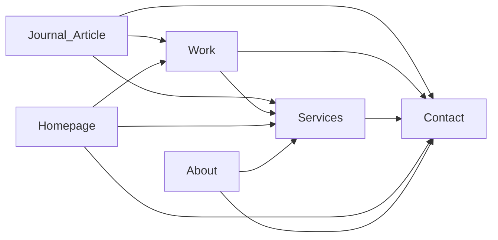

# SEO Page-Keyword Map

**Business:** Freelance portfolio & landing page web designer  
**Location:** London, UK (local SEO optional layer)  
**Content engine:** Journal for long-tail and authority  
**Last updated:** May 2026

---

## Keyword Strategy Overview

| Priority | Keyword theme | Primary URL | Supporting URLs |
|----------|---------------|-------------|-----------------|
| Primary | portfolio website designer freelance | `/services` | `/`, `/work`, `/about` |
| Secondary | landing page designer | `/services` | `/work/[slug]`, `/journal` |
| Secondary | creative portfolio design | `/work` | `/work/[slug]`, `/` |
| Secondary | SaaS landing page | `/work/[slug]` | `/services`, `/journal` |
| Local | portfolio designer London | `/services`, `/about` | `/journal` (1 local post) |
| Long-tail | how to build a portfolio website | `/journal/[slug]` | `/services`, `/contact` |
| Long-tail | best portfolio design 2026 | `/journal/[slug]` | `/work` |

---

## Page-Level SEO Specs

### `/` — Homepage

| Field | Content |
|-------|---------|
| **Primary keyword** | landing page designer, portfolio website designer |
| **Title tag** | Jawad Jalal — Landing Page & Portfolio Website Designer |
| **Meta description** | I design and build high-converting landing pages and portfolio websites for creatives, SaaS founders, and brands. Based in London. Book a call. |
| **H1** | The kitchen for mouth-watering portfolios and landing pages |
| **H2 examples** | My dishes · Five courses in five days · My ingredients |
| **Internal links** | `/services`, `/work`, `/contact`, top 3 case studies |
| **Schema** | `Person`, `WebSite`, `ProfessionalService` (optional) |

---

### `/services` — Services (Primary SEO landing)

| Field | Content |
|-------|---------|
| **Primary keyword** | portfolio website designer freelance |
| **Secondary keywords** | landing page designer, freelance web designer portfolio |
| **Title tag** | Portfolio & Landing Page Design Services — Freelance \| Jawad Jalal |
| **Meta description** | Freelance portfolio and landing page packages for creatives and founders. Clear pricing, 5-day process, studio-quality craft. London & remote. |
| **H1** | Portfolio and landing page packages, built to convert. |
| **H2 examples** | Portfolio website package · Landing page package · Add-ons · FAQ |
| **Internal links** | `/work`, `/contact`, `/about`, relevant case studies |
| **Content notes** | Use "freelance" and "portfolio website designer" naturally in first 100 words; include London once |

---

### `/work` — Work index

| Field | Content |
|-------|---------|
| **Primary keyword** | creative portfolio design, portfolio website examples |
| **Title tag** | Portfolio & Landing Page Case Studies — Web Design Work |
| **Meta description** | Case studies of portfolio websites and landing pages — problem, approach, and results for creatives, SaaS, and brands. |
| **H1** | Selected work — portfolios and landing pages that perform. |
| **Internal links** | Each case study, `/services`, `/contact` |

---

### `/work/[slug]` — Case studies

| Field | Content |
|-------|---------|
| **Primary keyword** | [project type] + portfolio design / landing page design |
| **Title pattern** | [Project Name] Case Study — [Portfolio / SaaS Landing Page] Design |
| **Meta pattern** | How [client type] achieved [result] with a custom [portfolio/landing page]. Problem, approach, and results. |
| **H1** | Project name |
| **H2 structure** | The Problem · My Approach · The Result |
| **Internal links** | `/services`, `/contact`, 2 related case studies |
| **Schema** | `CreativeWork` or `Article` |

**Target case study for SaaS keyword:**

- One case study optimized for `SaaS landing page` in title, URL slug, and body (e.g. `/work/saas-product-landing-page`)

---

### `/about` — About

| Field | Content |
|-------|---------|
| **Primary keyword** | portfolio designer London, freelance web designer London |
| **Title tag** | About Jawad Jalal — Portfolio & Landing Page Designer, London |
| **Meta description** | London-based freelance web designer specializing in portfolio websites and landing pages. Story, process, and tools. |
| **H1** | I build portfolios and landing pages that change trajectories. |
| **Local SEO** | Mention London, UK in body and footer; optional `areaServed` in schema |

---

### `/journal` — Blog index

| Field | Content |
|-------|---------|
| **Primary keyword** | web design blog, portfolio design tips |
| **Title tag** | Journal — Web Design, Portfolios & Landing Pages |
| **Meta description** | Articles on portfolio design, landing page conversion, tools, and the business of freelance web design. |
| **H1** | Notes on web design, conversion, and the tools I use. |

---

### `/journal/[slug]` — Articles

| Field | Content |
|-------|---------|
| **Strategy** | One primary long-tail keyword per article |
| **Title** | Include target keyword naturally |
| **Internal links** | Minimum 2: `/services`, `/contact` or `/work` |
| **CTA in post** | Book a Call + contextual link to services |

---

### `/contact` — Contact

| Field | Content |
|-------|---------|
| **Primary keyword** | hire portfolio website designer, landing page designer hire |
| **Title tag** | Contact — Hire a Portfolio & Landing Page Designer |
| **Meta description** | Book a 15-minute call or send a project brief. Portfolio and landing page design for creatives and founders. Reply within 24 hours. |
| **H1** | Start your next site in the kitchen. |

---

### `/404`

| Field | Content |
|-------|---------|
| **Robots** | `noindex, nofollow` |

---

## Long-Tail Content Calendar (Journal)

Map each article to a keyword cluster and conversion path.

| # | Target keyword | Suggested slug | Funnel CTA |
|---|----------------|----------------|------------|
| 1 | how to build a portfolio website | `how-to-build-portfolio-website` | View Services |
| 2 | best portfolio design 2026 | `best-portfolio-design-2026` | See what's cooking |
| 3 | portfolio website designer freelance | `why-hire-freelance-portfolio-designer` | Book a Call |
| 4 | landing page designer | `what-makes-a-high-converting-landing-page` | Book a Call |
| 5 | SaaS landing page | `saas-landing-page-design-guide` | View Services |
| 6 | creative portfolio design | `portfolio-design-for-creatives` | See what's cooking |
| 7 | portfolio designer London | `portfolio-designer-london` | Contact |
| 8 | Cursor AI web design | `cursor-claude-web-design-workflow` | About / Services |

**Publishing priority for launch:** #1, #4, #8 (authority + long-tail + tool SEO)

---

## Internal Linking Rules

| From | To | Anchor text examples |
|------|-----|----------------------|
| Journal article | `/services` | portfolio design services, landing page packages |
| Journal article | `/contact` | book a call, start your project |
| Journal article | `/work/[slug]` | see the full case study |
| Case study | `/services` | portfolio package, landing page package |
| Case study | `/contact` | start a project, book a call |
| Homepage | `/services` | view packages, full process |
| All pages | `/contact` | book a call (header/footer) |

---

## Local SEO (Optional — London)

| Element | Implementation |
|---------|----------------|
| NAP consistency | Jawad Jalal · London, UK — same in footer, About, Contact |
| `/services` copy | One paragraph: "Working with clients in London and remotely worldwide." |
| Local blog post | `portfolio-designer-london` — journal article |
| Google Business Profile | If taking local clients — link to `/contact` |
| Schema `areaServed` | London, United Kingdom, Worldwide |

---

## Technical SEO Checklist (Pre-Launch)

- [ ] Unique title + meta per page
- [ ] One H1 per page
- [ ] Semantic heading hierarchy (H2 → H3)
- [ ] Canonical URLs on all pages
- [ ] Open Graph + Twitter cards (title, description, og:image per page type)
- [ ] `sitemap.xml` — all indexable routes
- [ ] `robots.txt` — allow crawl; disallow admin/draft if any
- [ ] Image alt text — descriptive, keyword where natural
- [ ] Core Web Vitals — image optimization, lazy load
- [ ] Mobile-friendly responsive layout
- [ ] HTTPS on production domain

---

## Competitor Gap Keywords (Monitor)

Track rankings later for:

- conversion-focused portfolio designer
- studio kitchen portfolio website
- 5 day landing page design
- framer / webflow alternative freelance designer
- AI-assisted web design freelance

---

## Success Metrics (SEO → Conversion)

| Metric | Tool | Target signal |
|--------|------|---------------|
| Organic sessions | Analytics | Growth month-over-month |
| Landing page organic → contact | GA4 events | Assisted conversions |
| Keyword rankings | Search Console | Top 20 for primary within 6 months |
| Journal → services click | Event tracking | >5% of article sessions |
| Case study → contact | Event tracking | >8% of case study sessions |

---

## Related Documents

- [IA Sitemap](./ia-sitemap.md)
- [Page Briefs](./page-briefs.md)
- [Voice & Copy Framework](./voice-and-copy-framework.md)
- [CTA & Messaging Matrix](./cta-messaging-matrix.md)
