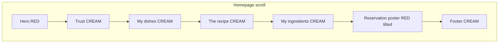

# Studio Kitchen — Visual Direction

**Brand:** Jawad Jalal · Portfolio & Landing Page Specialist  
**Companion copy:** [voice-and-copy-framework.md](./voice-and-copy-framework.md)  
**Companion tokens:** [design-token-system.md](./design-token-system.md)  
**Visual proof:** [design-token-showcase-v3.html](./design-token-showcase-v3.html)  
**Last updated:** May 2026

---

## North star

> **Warm paper studio with red poster bookends** — cream canvas, black ink typography, Steak-inspired chunky UI, tomato red hero and reservation band, mustard primary actions, simple kitchen line art. Proof sections stay clean and screenshot-led.

**3-second visual emotion:** *Friendly, bold, easy to hire — like ordering from a kitchen you trust.*

**Reference:** [steak.studio](https://steak.studio) — take poster energy, cream editorial body, pill buttons with thick strokes; skip dark/neon variants and full sticker-bomb backgrounds.

---

## What we take from Steak

| Take | Skip |
|------|------|
| Red hero poster with grid texture | Black default canvas site-wide |
| Cream paper body sections | Neon green script accents |
| Mustard + white pill CTAs on red | Dense sticker-wall backgrounds |
| Script + heavy caps pairing | Crypto/agency tone in layout density(fredoka display, caveat script) | Tilt on every card |
| One tilted reservation poster | Halftone mission-control |

---

## Page rhythm



| Route | Hero surface |
|-------|----------------|
| `/` | **Red** poster hero |
| `/contact` | **Red** poster hero |
| All other routes | **Cream** hero band (black type) |

---

## Color roles

| Token | Hex | Usage |
|-------|-----|--------|
| `heat.red` | `#E63946` | Hero bg, reservation poster, contact hero |
| `heat.red.dark` | `#C1121F` | Grid texture overlay, pressed states |
| `accent.mustard` | `#F4B942` | Hero primary CTA, poster primary button |
| `accent.mustard.hover` | `#F7C948` | Mustard hover |
| `paper.cream` | `#FCEAD4` | Default section background |
| `paper.cream.dark` | `#F5DFC4` | Subtle section alternation |
| `surface.card` | `#FFFFFF` | Cards on cream (dishes, ingredients, services rows) |
| `ink.black` | `#000000` | Headlines, borders, button labels |
| `ink.muted` | `#5C4A3A` | Body secondary on cream (warm brown-gray) |
| `ink.onRed` | `#000000` | Headlines on red (Fredoka black) |
| `ink.onRed.alt` | `#FFFFFF` | Script on red, optional white headline variant |

**Accent budget:** ~70% paper · ~25% ink · ~5% heat (red + mustard combined on screen at once)

Semantic colors (forms only): success `#22C55E` · error `#EF4444` · info `#3B82F6`

---

## Typography

| Role | Family | Weights | Use |
|------|--------|---------|-----|
| **Display** | Fredoka | 600–700 | Logo, H1–H3, buttons, poster caps |
| **Script** | Caveat | 700 | *Ready to order?* · optional single accent word |
| **Body** | Inter | 400–500 | Subheads, cards, forms, case study body |
| **Kicker** | JetBrains Mono | 500 | Section labels, metadata, uppercase |

### Rules

- **Max 3 voices** on screen: Fredoka + Caveat + Inter (mono is utility).
- **Script:** poster script line only (+ max one accent per viewport). Never body, nav, or forms.
- **Poster shout:** Fredoka 700, ALL CAPS, tight tracking (`-0.02em`).
- **Hero H1 on red:** Fredoka 700, black preferred; test white if contrast fails on long lines.
- **Kick on cream:** JetBrains Mono, `ink.muted`, uppercase, `0.08em` letter-spacing.

### Google Fonts load

```
Fredoka:wght@600;700
Caveat:wght@700
Inter:wght@400;500;600
JetBrains+Mono:wght@400;500
```

---

## UI signatures

### Buttons (pill)

| Variant | Fill | Border | Label | Shadow |
|---------|------|--------|-------|--------|
| **Primary (mustard)** | `#F4B942` | `3px solid #000` | `#000` Fredoka 600 | `4px 4px 0 #000` |
| **Secondary (white)** | `#FFF` | `3px solid #000` | `#000` | `4px 4px 0 #000` |
| **Ghost (cream)** | transparent | `2px solid #000` | `#000` | none |
| **Header Book a Call** | white on red hero; ghost on cream scroll | | | |

**Interaction:** hover → `translate(1px, 1px)` + shadow `2px 2px 0 #000`; active → `translate(4px, 4px)` + shadow none. Animate `transform` and `opacity` only.

### Cards

- White `#FFF` on cream, `2px solid #000`, radius `16–20px`
- **No tilt** on dish/ingredient cards (tilt reserved for reservation poster container)
- Work cards: screenshot-first; black border; hover border stays black (no cyan glow)

### Texture

- **Red sections:** subtle dark grid at ~8% opacity (`heat.red.dark` lines on `heat.red`)
- **Cream sections:** optional dot grid at ~4% opacity — omit if busy

### Reservation poster (`#cta`)

| Element | Spec |
|---------|------|
| Container | `heat.red` bg, `2–3°` clockwise tilt, thick black border, hard shadow |
| Script | Caveat 700, white, optional `1.5px` black text-stroke |
| Shout | **PLACE YOUR ORDER** — Fredoka 700 caps, black |
| Subline | Inter 400, white or black per contrast test |
| Buttons | Mustard primary (Book a Call / Place your order) + white secondary (Start an Inquiry), `OR` between |
| Illustration | Optional line-art hand/plate — right side, black stroke |

---

## Section visual map (homepage)

| Section | Surface | Heading font | Notes |
|---------|---------|--------------|-------|
| Nav | Transparent on red → cream on scroll | Fredoka wordmark | Book a Call always visible |
| Hero | Red | Fredoka H1 black | Mustard + white CTAs; kitchen illustration right (TBD) |
| Trust | Cream | Inter | Copy-only strip |
| `#work` | Cream | Fredoka **My dishes** | Kicker: From the pass |
| `#process` | Cream | Fredoka **Five courses. Five days.** | Recipe connector line |
| `#tools` | Cream | Fredoka **My ingredients** | Kicker: The pantry |
| `#cta` | Red poster | Caveat + Fredoka caps | Tilted band |
| Footer | Cream | Inter | Get the recipe newsletter |

---

## Illustration

| Use | Style |
|-----|--------|
| Hero (right column) | Black line art, 3–4px stroke, flat fills only for hair/shadow |
| Process steps | Simple icons (prep, taste, plate, oven, serve) |
| Poster accent | Hand signing / plate — optional |
| Work cards | **Screenshots only** — no food illustration over proof |

**Motifs:** hands plating, laptop on counter, simple bowl/plate icons — not literal food photography.

**Retired:** spaceman halftone assets in `brand_assets/hero/` — do not use for Studio Kitchen build.

---

## Motion

| Element | Behavior |
|---------|----------|
| Hero suffix | Crossfade `portfolios` ↔ `landing pages`, 4s hold, 400ms fade |
| Buttons | Press translate per UI signatures |
| Poster | Static (no wobble in v1) |
| `prefers-reduced-motion` | Static combined headline; no suffix rotation; no button transform |

---

## Do / don't

| Do | Don't |
|----|-------|
| Red on hero + reservation only | Red every section |
| Mustard for primary conversion on red | Mustard on every button site-wide |
| My dishes / My ingredients section titles | Rename Figma/Next.js to food puns |
| Plain Book a Call in header/footer | Script in navigation |
| Fredoka for display | DM Sans, Instrument Serif, Space Grotesk for this brand |
| One tilted poster per homepage | Tilted work grid |

---

## Related docs

| Doc | Role |
|-----|------|
| [voice-and-copy-framework.md](./voice-and-copy-framework.md) | Locked copy |
| [design-token-system.md](./design-token-system.md) | Token values + Tailwind |
| [design-token-showcase-v3.html](./design-token-showcase-v3.html) | Browser proof |
| [studio-kitchen-hero-prototype.html](./studio-kitchen-hero-prototype.html) | Hero frame |
| [portfolio-component-token-spec.md](./portfolio-component-token-spec.md) | Component mapping |

---

## Changelog

| Date | Change |
|------|--------|
| May 2026 | Initial Studio Kitchen visual direction — replaces Mission Control Monochrome |
