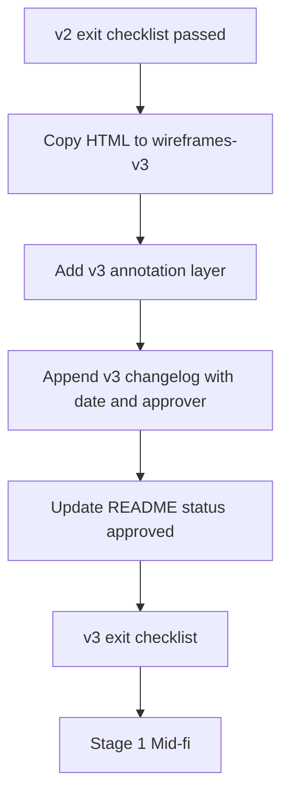

# v3 Handoff Spec — Build-Ready Wireframes

**Purpose:** Define Stage 0c — what v3 adds, how files promote, what mid-fi receives.  
**Prerequisite:** [v2-exit-checklist.md](./v2-exit-checklist.md) passed for funnel slice  
**Last updated:** May 2026

**Related:** [design-build-roadmap.md](../design-build-roadmap.md) Stage 0c · [pipeline-overview.md](./pipeline-overview.md)

---

## v3 goal

Final low-fi **approval** with spacing/type/token labels and explicit deferrals. **No new product direction** — v3 labels what v2 already shows.

Mid-fi (Stage 1) must not start until v3 exit passes for **all 10 routes** (see [wireframes-v3/README.md](../wireframes-v3/README.md)).

---

## v3 additions (on top of v2)

| Addition | Example | Source |
|----------|---------|--------|
| Section ID labels | `#hero`, `#trust`, `#why-order`, … | page-matrix |
| Type scale callouts | `font.display` Fredoka · `font.size.h2` | design-token-system |
| Spacing callouts | `section-v-desktop: 96px` · `content-max: 1280px` | design-token-system |
| Component token names | `shadow.sticker` · `radius.lg` · `border.width.bold` | portfolio-component-token-spec |
| Deferral ledger | hi-fi vs production vs post-launch | This doc § Deferrals |
| Conversion sign-off | Proof-first funnel approved | homepage-conversion-flow |

**Typography labels use Studio Kitchen:** Fredoka (display) · Inter (body) · JetBrains Mono (kicker) · Caveat (poster script only). Not Space Grotesk / Mission Control.

---

## Deliverable location

```
docs/wireframes-v3/
  _v3-labels.css               # overlay label styles
  _v3-labels.js                # inject #section + token hints; toggle toolbar
  homepage-wireframe-v3.html
  order-wireframe-v3.html
  contact-wireframe-v3.html
  services-wireframe-v3.html
  work-wireframe-v3.html
  case-study-wireframe-v3.html
  404-wireframe-v3.html
  about-wireframe-v3.html
  journal-index-wireframe-v3.html
  journal-article-wireframe-v3.html
  README.md                    # v3 status hub + exit checklist
```

**Regenerate from v2:** `node scripts/promote-wireframes-v3.mjs`

**Alternative:** Keep files in `wireframes-v2/` and append a **v3 changelog + label block** in spec footer after approval. Prefer separate folder for clarity.

---

## Promotion workflow



### Step 1 — Copy

```text
docs/wireframes-v2/homepage-wireframe-v2.html
  → docs/wireframes-v3/homepage-wireframe-v3.html
```

Repeat for each approved route.

### Step 2 — v3 annotation layer

Choose one approach:

**A. CSS overlay labels** (preferred for review screenshots)

- Fixed-position tags on section edges: `#hero`, token names
- Toggle class `.show-v3-labels` on `<body>` for review mode

**B. Expanded spec footer**

- Add tables: section ID · type token · spacing token per block

### Step 3 — v3 changelog block

Append to each file footer:

```markdown
## v3 approval
- Date: YYYY-MM-DD
- Approver: [name]
- v2 source: homepage-wireframe-v2.html @ commit/ref
- Open questions: none
```

### Step 4 — Hub update

Set route status to `approved` in [wireframes-v2/README.md](./README.md) and v3 hub if created.

---

## Deferral ledger (standard text)

Every v3 file spec footer must classify deferrals:

### Deferred to hi-fi (Stage 2)

- Hero: centered mega-type poster (no illustration component)
- Hero Blender/video loop
- Spline 3D accents
- GSAP scroll scenes
- Work card secondary image on hover (when 2+ projects)
- Ken Burns / advanced motion

### Deferred to production (Stage 3)

- Live Calendly / Cal.com URL
- Supabase + Resend form backend
- Newsletter integration
- Real tool brand logos (replace emoji placeholders)
- Custom monogram if replacing SVG lockups

### Deferred post-launch (content)

- Testimonials section (2+ authentic quotes)
- Additional case studies (expand work grid)
- Journal articles (empty state at launch OK)
- Work filter/tags (when N>1 projects)

---

## v3 exit checklist

All 10 routes ready for mid-fi when:

- [x] All v3 HTML files exist under `docs/wireframes-v3/` (10 routes)
- [x] Homepage: sections include `#why-order`; no testimonials
- [x] Work: Option B + hover documented
- [x] Case study: 8-block template labeled
- [x] Services: packages + FAQ + `#why-*` anchors labeled
- [x] Contact + order: form layouts + states labeled
- [x] About: 6 sections labeled
- [x] Journal: index + article template labeled
- [x] 404: recovery layout labeled
- [x] Global chrome on all pages
- [x] Overlay labels (`.show-v3-labels`) + token table on every file
- [x] Deferral ledger complete on every file
- [x] Conversion sign-off recorded ([homepage-conversion-flow.md](../homepage-conversion-flow.md))
- [x] **No open layout or interaction questions**

**Status:** Stage 0c complete (2026-05-25). Sign-off in [wireframes-v3/README.md](../wireframes-v3/README.md).

---

## Mid-fi handoff package (Stage 1 entry)

Read in this order:

| Priority | File | Use |
|----------|------|-----|
| 1 | `docs/wireframes-v3/homepage-wireframe-v3.html` | Canonical homepage layout + labels |
| 2 | Other `docs/wireframes-v3/*.html` | Per-route reference |
| 3 | [design-token-system.md](../design-token-system.md) | CSS variables + Tailwind snippet |
| 4 | [portfolio-component-token-spec.md](../portfolio-component-token-spec.md) | Component mapping |
| 5 | [page-briefs.md](../page-briefs.md) | Copy blocks |
| 6 | [cta-messaging-matrix.md](../cta-messaging-matrix.md) | CTA labels (note `/order` session overrides) |
| 7 | [ia-sitemap.md](../ia-sitemap.md) | Routes |
| 8 | [launch-strategy-v1.md](../launch-strategy-v1.md) | v1 launch constraints |

**Mid-fi slice order** (from roadmap):

1. Foundation — `globals.css`, `tailwind.config.ts`, fonts in `layout.tsx`
2. Layout — Navbar, Footer per shared-chrome-spec
3. Homepage sections — one component per section ID
4. Remaining routes — static content from page briefs

**Explicit non-goals at mid-fi start:** Spline, Lenis, hero video, live form POST, testimonials.

---

## Relationship to Stitch

Stitch `.stitch/DESIGN.md` and generated screens are **reference only**. Approved v3 HTML in this repo is the build handoff authority for layout and behavior.

---

## Changelog

| Date | Change |
|------|--------|
| May 2026 | Initial v3 handoff spec; Studio Kitchen typography; `/order` in funnel |
| 2026-05-25 | Stage 0c complete: 10 routes in `wireframes-v3/`; overlay labels + sign-off |
